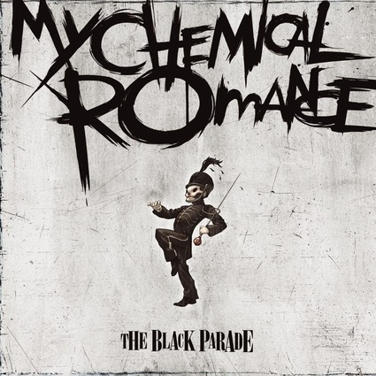

# A Love Letter To The Black Parade
### Album Analysis by Gavin Fredrick B. Torre

---
## Album Release Reception and Attention.

The Black Parade was released by Alt-Rock/Pop-Punk Band My Chemical Romance on October 24, 2006 in the United States, and a day earlier in Europe.
The band rose to new heights, going from performing in sweaty crammed basements to selling out stadiums. The album was critically acclaimed by most
critics, due to being a well respected and rarely attempted rock opera album. The album redefined the emo/pop-punk scene entirely, with it's 4 
beloved singles:

### I Don't Love You 
<iframe style="border-radius:12px" src="https://open.spotify.com/embed/track/4RAOI1etsgbh5NP3T5R8rN?utm_source=generator" width="100%" height="352" frameBorder="0" allowfullscreen="" allow="autoplay; clipboard-write; encrypted-media; fullscreen; picture-in-picture" loading="lazy"></iframe>

### Teenagers
<iframe style="border-radius:12px" src="https://open.spotify.com/embed/track/7j31rVgGX9Q2blT92VBEA0?utm_source=generator" width="100%" height="352" frameBorder="0" allowfullscreen="" allow="autoplay; clipboard-write; encrypted-media; fullscreen; picture-in-picture" loading="lazy"></iframe>

### Famous Last Words
<iframe style="border-radius:12px" src="https://open.spotify.com/embed/track/2d6m2F4I7wCuAKtSsdhh83?utm_source=generator" width="100%" height="352" frameBorder="0" allowfullscreen="" allow="autoplay; clipboard-write; encrypted-media; fullscreen; picture-in-picture" loading="lazy"></iframe>

And of course, the leading single and one of if not the greatest song of all time.

### Welcome To The Black Parade
<iframe style="border-radius:12px" src="https://open.spotify.com/embed/track/5wQnmLuC1W7ATsArWACrgW?utm_source=generator" width="100%" height="352" frameBorder="0" allowfullscreen="" allow="autoplay; clipboard-write; encrypted-media; fullscreen; picture-in-picture" loading="lazy"></iframe>

With over 300 Million views on YouTube, and over half
a million streams on spotify, this song was a generational anthem, dubbed as "The Emo Bohemian Rhapsody"

## Tracklisting And Individual Track-Dissection and Analysis.

### Track 1. The End.

The End. (The period is part of the title) is the opening track of this masterpiece, very similiar to the opening of "The Wall" by Pink Floyd, how
the song suddenly drops into soaring guitar harmonies, the heavily layered vocal harmonies and grand elements to the song establish it's place as
a rock opera, building up at the end of the song before perfectly transitioning into the song "Dead!"

### Track 2. Dead!

Dead! (Excalmation Point Included) is the second track of the album, it's a very fast and energetic song, it's almost cheerful and happy despite
the song topic being so morbid, it's sinister disregard of the patient's life and how nonchalant the thought of disappearing from the face of the
earth is treated is perfect, perfectly capturing how the emo genre takes negative things and turns it into a fun, happy, and energetic journey.

### Track 3. This Is How I Disappear

This Is How I Disappear is a very dark and disturbing third track, it deals with the thought of the patient's lover and how their rocky, abusive relationship
is affected by the eventual death of the patient, how they speak of seances, and establishing a romantic connection with the dead, not to mention the absolutely
crushing breakdown where the patient breaks down, screaming about how they can't hurt them anymore due to being dead.

### Track 4. The Sharpest Lives

The Sharpest Lives is a classic and catchy rock song, the lyrical talent of lead singer Gerard Way truly shines in this song, a song about how the patient would
rather kill themself instead of letting their illness catch up to them, taking their own life instead of letting death do it. The song deals with alcohol and drug
use, how the patient is actively trying to take the pain away by drinking themself to death, living The Sharpest Life he can before he eventually passes.

### Track 5. Welcome To The Black Parade

Welcome To The Black Parade is a generational anthem and is a perfect fifth track, one of the greatest songs to ever be released, if not the greatest.
Welcome To The Black Parade is the leading single of The Black Parade, it's lyrics deal with the concept of how death takes you in the form of your fondest memory.
In the song, the depicted patient's fondest memory is visiting the city to see a marching band with his father, which is why death takes him in the form of **The Black Parade**.

Not only is the song unbelievably iconic, but the unique marching band elements mixed in to the rock opera are absolutely gorgeous, the song takes it to the next level
with a key change and gorgeous guitar solo with harmonies, Lead Guitarist Ray Toro was very clearly influenced by Queen's Brian May, due to the structure of the guitars.
This song is an absolute masterpiece, the writing is fantastic and has pieces of death scattered around in it, and the song itself is catchy, memorable and has a grand ending
where the tempo is cut in half, the vocals are roaring and absolutely unbelievably, reaching the highest notes any male can hit, and soaring guitars and marching band elements.

### Track 6. I Don't Love You

I Don't Love You is a slow sixth song, a relaxing and somber track to slow the pace down after the first 4 fast tracks and of course, "Welcome To The Black Parade" 
It deals with the patient's lover once again, how their rocky relationship was going before the patients death. The song doesn't explore as much interesting areas
of the bands musical genius, however it didn't need any thing unbelievable and grand, it's a perfectly written and produced slow rock song that's perfectly
adequate and classic in it's style.

### Track 7. House Of Wolves

House Of Wolves is an very sudden pick up from I Don't Love You, being one of the messiest and loudest songs on the album. It deals with the idea of where the patient
is going after he dies, and how he's done enough bad to the point where he believes he's going to hell. It's a very sinister and evil song, it's loud, playful and 
unbelievably aggressive. The pushing and pulling of guitars at the end before the awesome guitar solo make it a track to remember.

### Track 8. Cancer

Cancer is the very somber midpoint of the album, being one of the most tragic, and heart breaking songs in the entire bands catalogue. Cancer is the patient reflecting
on how he fears that he'll cause his loved ones great pain when he passes, talking about how cancer has stripped him off his once promising, potential filled life, he
will never marry, he will never live a long, prosperous life, he will die young, and will have lived a meaningless life, the emotion and the writing is pure genius,
the instrumentation is just as well produced, being simple and stripped back compared to the usual messy nature of the album.

### Track 9. Mama

Mama is a sinister song talking about the patient in war, speaking of how his mother is disgusted of him for going to war, and killing lots of people. The song
is a brutal unrelenting track that is unforgiving in its evil, yet playful nature, the writing talking about the horrors of what the person going to war and their
loved ones experiences. The song has an absolutely gutwrenching, crushing breakdown as the patient yells repeatedly for their mother, portraying them going insane
in war, and the ending is equally as horrifyingly awesome, as he accepts his death in war along with his fellow brothers in arms, and wears his horrifc crimes like a badge of pride.
The guitars are absolutely incredible in this song, the vibe and rhythm is playfully sinister, and the song structure is pure genius, making it one of the best songs on the album.

### Track 10. Sleep

Sleep is one of the most horrifying songs on the entire album, beginning with a tape recording of Gerard Way speaking of his reccuring nightmares about his loved ones dying before
the door is suddenly kicked down by soaring, roaring guitar harmonies, the guitar tone on this song being pushed even further than any other song on the album. The song is seemingly
a cry of defiance from the patient, how he isn't sorry for all the pain he has caused, to his mother, to his lover, to everyone, he wonders how people feel sorry for him and cry for him
as he continues to live through his nightmare, his life is lost and practically already over, his spirit is broken and defeated, he has killed many in war, and has ruined his relationship
with nearly everybody he once knew and cherished. 

The finale of the song is one of the greatest moments on the entire record, as the patient repeatedly yells out to "Just Sleep", before the guitars are pushed even further as he now
begins to scream "Wake Up", his screams now buried behind the screaming guitars. It is truly one of the most crushing moments of the album, the patient practically having no faith
as his life and everything that once was is now desolate and hopeless.

### Track 11. Teenagers

Teenagers is the most popular song on the album and from My Chemical Romance in general, it's a fun, loud, cheery song about the patient thinking about teenagers and how
unhinged they are, this song comes from a very real fear of teenagers from Gerard Way, the guitars on the song are very pronounced, and the drum beats and fills are all
sloppily thrown together with the song, creating a loose, messy, yet incredible song.

### Track 12. Disenchanted

Disenchanted is another tragic song about the patient reflecting on his life, how he continues to ponder on the fact that his life is useless, and has left no real lasting impact
on the world, he spent his highschool life being shoved to agree, being put in place, treated as a number, his life was merely a sad song with nothing to say, how everything
has basically just been a life long wait for a hospital stay, and there was nothing he could do about it as he was going to die of cancer. The instrumentation in this song is
absolutely gorgeous, with very pronounced string instruments, and passionate vocal harmomies and melody. The acoustic guitar is easily one of the best elements of the song
and is a well deserved break from the usual loud, angry music.

### Track 13. Famous Last Words

Famous Last Words is one of the most beautiful songs released by My Chemical Romance, being the closer of the album, the song is the patient getting up and getting ready to face
the afterlife, unafraid to walk the afterlife alone and abandon his old meaningless life. It's a beautifully placed track, coming right after the somber Disenchanted, it's a very
powerful sudden surge of motivation and will to carry on, the ending of the song is one of the greatest final moments of any album, with Gerard hitting one of the highest notes
possible for any male to hit (D5), the song also has gorgeous instrumentation, with string instruments and incredible guitar riffs, with the ending having the instrumental fade out
and letting the vocals repeat the chorus one more time, signifying the end of the album.

## The Patient's Analysis 

The entire album is centered around the patient. The patient is a young man who has lived a meaningless life, he went to war, killed many, came back, and now has cancer. The patient
is a very morally comprimised character, he doesn't care for the pain he has caused for his lover, mother, or the others he had killed, he treats everything around him with a lack
of care, and he seems to be very selfish at times. The only time the patient is seen displaying good character is the song Cancer, where he truly does feel as if the hardest part of
leaving is the heartbreak he causes, however, his selflesness and concern for others is quickly wiped away in songs like Mama and Sleep, where he wears his horrible actions with pride.

